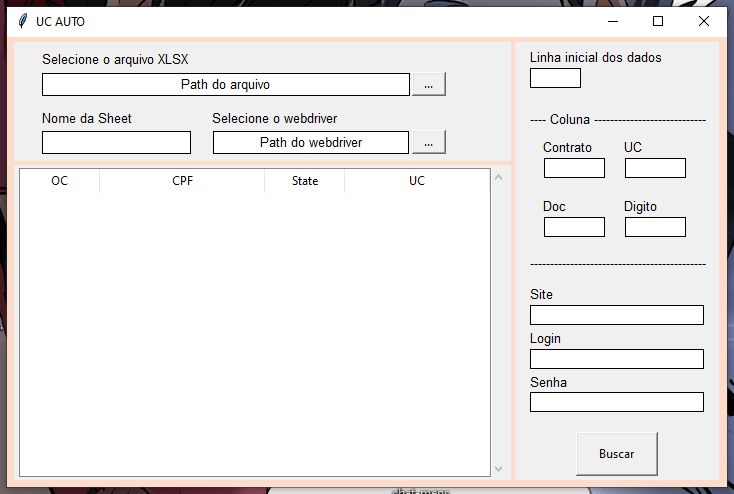

# projeto-web-scraping-UC

Automação de captura de UC usando python, beautifulsoup, selenium, openpyxl e pandas. Usado para automatizar um processo no meu jovem aprendiz 
redução de 3 horas -> 10min

